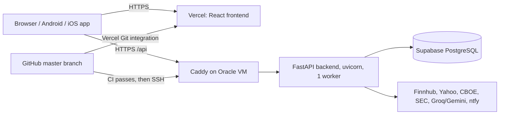

# StockPilot setup and handover guide

This guide is for setting StockPilot up on a new computer and running it without outside help. Read section 1 **before** you lose access to the current machine.

- What the app does, screen by screen: [intro.md](intro.md)
- Project overview and API key list: [README.md](README.md)
- Steps before each production release: [deploy/RELEASE_CHECKLIST.md](deploy/RELEASE_CHECKLIST.md)

---

## 1. Do this before you lose access to the current machine

None of these items are in GitHub. Keep them somewhere safe, such as a password manager:

| Save | Where it is now | Why you need it |
| --- | --- | --- |
| Every value in `backend/.env` (`JWT_SECRET`, `GROQ_API_KEY`, `GEMINI_API_KEY`, `FINNHUB_API_KEY`, `TWELVEDATA_API_KEY`, `SEC_USER_AGENT`, `CORS_ORIGINS`, ...) | `backend/.env` on this machine | Without these the app has no AI or real-time data. Keep the **same `JWT_SECRET`** if you want old account-transfer files to import. |
| Your local data | `backend/stockinsights.db` (SQLite). The E*TRADE imports you tested locally live here, **not** in production. | Run `.venv\Scripts\python.exe backend\backup_sqlite.py` and copy the file from `backups\`. Or use **Portfolio → Export to another account** to get a JSON file. |
| SSH private key for the Oracle VM | Wherever you created it (often `~/.ssh/`) | Needed to log in to the production server. GitHub holds a copy in a secret, but GitHub never shows secrets again. |
| The production `backend/.env` on the VM, including `DATABASE_URL` | `~/stock-insights/backend/.env` on the VM | Run `ssh ubuntu@157.151.152.97 "cat ~/stock-insights/backend/.env"` and store the output safely. |
| `BACKUP_PASSPHRASE` | A GitHub secret, and wherever you first wrote it | Without it the weekly database backups cannot be decrypted. |
| Logins for GitHub, Vercel, Supabase, Oracle Cloud, Groq, Google AI Studio, Finnhub, Twelve Data, Sentry (if used), ntfy topic | Your accounts | Every service is on a free tier, but you must be able to sign in to each one. |

Finally, run `git status` and push anything that isn't pushed yet.

---

## 2. How the pieces fit together



| Piece | Production | Local development |
| --- | --- | --- |
| Frontend | https://stock-insights-dashboard.vercel.app (Vercel) | http://localhost:5173 (Vite; `/api` is forwarded to port 8000) |
| Backend | https://157-151-152-97.sslip.io (Oracle Cloud Always Free ARM VM, Ubuntu 24.04, Caddy for HTTPS, systemd service `stock-insights`) | http://localhost:8000 (uvicorn) |
| Database | Supabase PostgreSQL (`DATABASE_URL`) | SQLite file `backend/stockinsights.db`, used when `DATABASE_URL` is empty |
| CI/CD | `.github/workflows/ci.yml` (tests), `deploy-oci.yml` (backend deploy), `db-backup.yml` (weekly encrypted backup) | `scripts/check.ps1` runs the same checks |

Versions: **Python 3.13** (`backend/.python-version` says 3.13.14), **Node 22**, React 19, Vite 6, Capacitor 8.

---

## 3. Set up on a new computer

### 3.1 Install the tools

- Git: https://git-scm.com/downloads
- Python 3.13: https://www.python.org/downloads/ (on Windows, tick **Add python.exe to PATH**)
- Node.js 22 LTS: https://nodejs.org
- Optional: VS Code
- Optional: Android Studio (for the Android app)
- Optional: a Mac with Xcode (for the iOS app)

### 3.2 Clone and set up

```powershell
git clone https://github.com/saikovuri/Stock_Insights_dashboard.git
cd Stock_Insights_dashboard
powershell -ExecutionPolicy Bypass -File scripts\setup-local.ps1     # Windows
```

```bash
bash scripts/setup-local.sh                                          # macOS / Linux
```

The script:
1. creates `.venv` and installs the backend packages;
2. creates `backend/.env` from `.env.example` with a fresh random `JWT_SECRET`, if the file doesn't exist yet;
3. runs `npm install` in `frontend/`;
4. installs the Playwright test browser.

### 3.3 Fill in `backend/.env`

Paste the values you saved in section 1. If you are starting fresh, every key below has a free tier:

| Variable | Needed? | What it does / where to get it |
| --- | --- | --- |
| `JWT_SECRET` | **Yes** | Signs logins and account-transfer files. Use a long random string. Changing it logs everyone out and invalidates old transfer files. |
| `DATABASE_URL` | Production only | PostgreSQL connection string (Supabase → Connect). Leave it empty locally to use SQLite. The backend refuses to start with the default secret when this is set. |
| `CORS_ORIGINS` | Yes | Comma-separated frontend origins. Local: `http://localhost:5173`. The VM also needs `https://stock-insights-dashboard.vercel.app,capacitor://localhost,http://localhost`. |
| `GROQ_API_KEY` / `GEMINI_API_KEY` | Recommended | AI brief, chat, sentiment, doctor and weekly review. Keys from https://console.groq.com/keys and https://aistudio.google.com/apikey. `AI_PROVIDER=groq` or `gemini` picks which one is tried first. |
| `OPENAI_API_KEY`, `OPENAI_MODEL` | Optional | Only if `AI_PROVIDER=openai`. |
| `FINNHUB_API_KEY` | Recommended | Real-time quotes, news and earnings (https://finnhub.io/register). Without it the app falls back to Yahoo. `FINNHUB_RATE_PER_MIN` defaults to 55. |
| `TWELVEDATA_API_KEY` | Optional | Price-history fallback. |
| `SEC_USER_AGENT` | Yes | `StockPilot your@email.com`. SEC requires a contact address. |
| `SCHEDULER_ENABLED` | Optional | `1` (default) runs the alert scan and morning briefing. Use `0` for one-off scripts. |
| `ALERT_SCAN_MINUTES`, `BRIEFING_HOUR_ET`, `PRICE_CHANGE_ALERT`, `VOLUME_SPIKE_ALERT` | Optional | Alert timing and thresholds. |
| `NTFY_SERVER` | Optional | Phone push server (default https://ntfy.sh). Each user enters their topic in the app. |
| `TOKEN_EXPIRE_MINUTES`, `REFRESH_EXPIRE_DAYS` | Optional | Session length (defaults: 60 minutes and 30 days). |
| `EXTERNAL_CONTEXT_ENABLED` | Optional | `0` turns off the Reddit attention and prediction-market feeds. |
| `RESEARCH_UNIVERSE_SOURCE` | Optional | Dated S&P constituent snapshots for the scanner (see README). |
| `SENTRY_DSN`, `SENTRY_ENVIRONMENT` | Optional | Backend error tracking. |
| `STOCKPILOT_DB_PATH` | Optional | A different SQLite file path. Tests set this themselves. |

Frontend build variables (set in Vercel, or in a `frontend/.env.local` file):

| Variable | What it does |
| --- | --- |
| `VITE_API_URL` | Backend origin without `/api`, e.g. `https://157-151-152-97.sslip.io`. Leave it empty locally (Vite forwards `/api`). The native mobile app falls back to the address hard-coded in `frontend/src/api/config.js`. |
| `VITE_SENTRY_DSN` | Optional frontend error tracking. |

### 3.4 Run it

```powershell
powershell -ExecutionPolicy Bypass -File scripts\dev.ps1      # opens two windows: backend and frontend
```

```bash
bash scripts/dev.sh                                           # Ctrl+C stops both
```

Open http://localhost:5173 and register a user. Locally the database starts empty unless you restore a backup (section 3.5).

Manual equivalent:

```powershell
cd backend; ..\.venv\Scripts\python.exe -m uvicorn main:app --port 8000 --reload
cd frontend; npm run dev
```

Check the backend at http://localhost:8000/api/health. It should return `{"status":"ok","db":"connected"}`.

### 3.5 Bring your data back

**SQLite backup:**
1. Stop the backend.
2. Delete `backend/stockinsights.db-wal` and `backend/stockinsights.db-shm` if they exist.
3. Copy the backup over `backend/stockinsights.db`.
4. Start the backend and sign in with your old username and password.

**Export file:**
1. Sign in to the new installation.
2. Go to Portfolio → **Import from another account**.
3. This needs the same `JWT_SECRET` as the installation that made the file.

**Into production:** sign in at the Vercel URL and use **Import from broker CSV** (Holdings) to re-import your E*TRADE positions files. Then check the cash balance in the account bar.

---

## 4. Testing

Run every check that CI runs (about 2–3 minutes):

```powershell
powershell -ExecutionPolicy Bypass -File scripts\check.ps1
```

```bash
bash scripts/check.sh
```

Run a single test:

| What | Command (from the repo root) |
| --- | --- |
| Backend, by name | `$env:PYTHONPATH='backend'; .\.venv\Scripts\python.exe -m unittest discover -s backend/tests -k next_steps` |
| Frontend unit test | `cd frontend; npx vitest run src -t "next steps"` |
| Browser (e2e) test | `cd frontend; npx playwright test -g "watchlist"` (builds are tested on port 4174) |

What the tests do:
- Backend tests use a throwaway SQLite database, never your real one.
- Browser tests use fake API responses, so they don't need API keys.
- CI also runs a disposable PostgreSQL 16 job (`backend/tests/postgres_checks.py`). Run it locally only against a database whose name ends in `_test` and with `STOCKPILOT_DISPOSABLE_DB=1`.

---

## 5. Production

### 5.1 How a change reaches production

1. Commit and `git push origin master`.
2. **Backend:** `deploy-oci.yml` runs the full CI. If CI passes, it SSHes into the VM and runs `deploy/update.sh` (`git pull`, install packages, restart the service, health check). This runs only when files under `backend/` or `deploy/` changed.
3. **Frontend:** Vercel builds `frontend/` on each push to master. It uses `vercel.json` for the build command and the security headers.
4. Check the result:
   - GitHub → Actions tab;
   - `curl https://157-151-152-97.sslip.io/api/health`;
   - open the Vercel URL.

GitHub repository secrets (Settings → Secrets and variables → Actions):

| Secret | Used by |
| --- | --- |
| `OCI_HOST` | Deploy. The VM's public IP (157.151.152.97). If it is empty, the deploy step is skipped. |
| `OCI_SSH_KEY` | Deploy. A private key whose public half is in the VM's `~/.ssh/authorized_keys`. |
| `OCI_KNOWN_HOSTS` | Deploy. Output of `ssh-keyscan 157.151.152.97`. |
| `DATABASE_URL` | Weekly backup. Supabase **session-mode** URI, port 5432. |
| `BACKUP_PASSPHRASE` | Weekly backup encryption. |

Vercel project environment variables: `VITE_API_URL` and, optionally, `VITE_SENTRY_DSN`. Redeploy after changing them.

### 5.2 Run the server by hand

```bash
ssh ubuntu@157.151.152.97
sudo systemctl status stock-insights          # is it running?
sudo journalctl -u stock-insights -f          # live logs
sudo systemctl restart stock-insights         # restart
bash ~/stock-insights/deploy/update.sh        # pull + restart (what CI does)
nano ~/stock-insights/backend/.env            # change settings, then restart
sudo journalctl -u caddy -n 50                # HTTPS / certificate problems
```

Health checks:
- `/health` only shows that the process is alive.
- `/api/health` also checks the database (it returns 503 if the database is down).
- `python backend/release_check.py --base-url https://157-151-152-97.sslip.io` runs read-only provider checks.

### 5.3 Rebuild the backend server from scratch

Use this if the VM is lost or you move to a new one.

1. **Create the VM.** Oracle Cloud → Create instance:
   - shape VM.Standard.A1.Flex (2 OCPU / 12 GB is free);
   - image Ubuntu 24.04 aarch64;
   - add your SSH public key.
   - Optional: paste `deploy/oci-cloud-init.sh` into *Advanced → cloud-init*.
2. **Open the ports.** In the VCN security list, allow inbound TCP 80 and 443.
3. **Start the setup.** SSH in and run:
   `curl -fsSL https://raw.githubusercontent.com/saikovuri/Stock_Insights_dashboard/master/deploy/oracle-setup.sh -o setup.sh && bash setup.sh`
4. **Fill in the settings.** The first run creates `~/stock-insights/backend/.env` and stops. Fill it in (`DATABASE_URL` and `JWT_SECRET` are required), then run the script again. It sets up:
   - Python 3.13 (through uv);
   - the systemd service;
   - Caddy with free HTTPS on `<ip-with-dashes>.sslip.io`, or on your domain if you pass it as an argument.
5. **If the IP or hostname changed, update all of these** (otherwise the browser blocks the API):
   - Vercel `VITE_API_URL`;
   - `connect-src` in [vercel.json](vercel.json) (the Content-Security-Policy header);
   - the native fallback URL in [frontend/src/api/config.js](frontend/src/api/config.js);
   - GitHub secrets `OCI_HOST` and `OCI_KNOWN_HOSTS`.
6. **Push.** Commit and push the file changes, then redeploy Vercel.

Lost your SSH key?
1. In the Oracle console, open the instance → **Console connection**, or use Cloud Shell.
2. Add a new public key to `~/.ssh/authorized_keys`.
3. Update the `OCI_SSH_KEY` secret.

Alternative host: [render.yaml](render.yaml) describes the same backend for Render.com. Render's free tier sleeps when idle, which pauses the scheduler.

### 5.4 Database (Supabase)

- **Tables:** the backend creates and updates tables itself at startup (`database.init_db`). There are no manual migrations.
- **Row-level security:** after a new database's first start, run [deploy/supabase_rls.sql](deploy/supabase_rls.sql) in the Supabase SQL editor. It blocks Supabase's public REST roles from your tables.
- **Backups:**
  - automatic every Sunday (GitHub Actions artifact, kept for 90 days);
  - manual: `DATABASE_URL=... bash deploy/backup.sh`.
- **Restore:** `gpg -d FILE.sql.gz.gpg | gunzip | psql "$TARGET_DATABASE_URL"`. Practise on a scratch database first.
- **Pausing:** free Supabase projects pause after a week without activity. The weekly backup counts as activity. If the project pauses anyway, press **Restore** in the Supabase dashboard.

### 5.5 Mobile apps (Capacitor)

The app ID is `com.stockinsights.app` and the web files come from `frontend/dist`.

**Android** (needs Android Studio):
1. Run `cd frontend; npm run cap:android`. This builds the frontend, copies it into `android/` and opens Android Studio.
2. Run on a device, or use Build → Generate Signed Bundle. Keep the signing keystore safe; you cannot update a Play Store app without it.

**iOS** (needs a Mac with Xcode and an Apple developer account):
1. Run `npm run cap:ios`.
2. Sign and run from Xcode.

The bundled app calls the URL in `VITE_API_URL`, or the fallback in `src/api/config.js`. Rebuild and re-sync whenever the backend address changes. Test on a real phone: login, background/resume, notifications.

---

## 6. Troubleshooting

| Symptom | Fix |
| --- | --- |
| Something seems broken and you don't know where to start | Sign in and open **System status** (footer). It shows the database, each data provider, AI configuration and the background jobs. Fix whatever is red first. |
| The page says "This view could not be displayed" after many edits while the dev server runs | Vite's hot reload got stale. Stop the frontend window and run `npm run dev` again, then hard-refresh the browser. |
| `npm install` / `npm ci` fails with EPERM or locked esbuild on Windows | Stop the dev servers first, then retry from inside `frontend/`. |
| `npm ci` fails downloading from `ms-feed-25.pkgs.visualstudio.com` | About 320 entries in `frontend/package-lock.json` were resolved through a Microsoft public package mirror on the old machine. It allows anonymous downloads today. If that stops: in `frontend/`, delete `package-lock.json` and `node_modules`, run `npm install --registry https://registry.npmjs.org/`, run `scripts/check.ps1`, then commit the new lockfile. |
| `npm audit` (or `scripts/check.ps1`) fails with ECONNRESET / "audit endpoint returned an error" | A network problem, not a vulnerability. Run `npm audit --audit-level=high` again later; CI runs it too. |
| The frontend shows network errors and the backend window shows CORS errors | Add the exact origin (scheme + host + port) to `CORS_ORIGINS` and restart the backend. |
| The production site loads but every API call fails | Check `VITE_API_URL` in Vercel and `connect-src` in `vercel.json`. The browser console shows CSP errors. |
| `/api/health` returns 503 | The database can't be reached. Check `DATABASE_URL` and whether Supabase is paused. |
| A backend test fails only between 8 pm and midnight Eastern | The test builds dates with `date.today()`. Use New York time (see the existing tests). |
| A PostgreSQL query works locally but fails on the server | Use `database.PH` for SQL placeholders (`?` in SQLite, `%s` in PostgreSQL); see `database._run`. |
| Option quote "unavailable" for a position | The data provider has no quote. The stress test refuses to guess; close or edit the position, or wait for a quote. |
| Quotes are slow or rate-limited | Finnhub's free tier allows about 60 calls/minute. Lower the number of watchlist and holding tickers, or set `FINNHUB_RATE_PER_MIN`. |

---

## 7. Where things are in the code

| Area | Backend | Frontend |
| --- | --- | --- |
| App entry, routes | `backend/main.py`, `routes_*.py`, `api_common.py` (auth dependency, rate limiter) | `src/App.jsx`, `src/api/stockApi.js` (all API calls) |
| Database | `database.py` (SQLite/PostgreSQL, schema in `init_db`), `accounting.py` (audit ledger) | — |
| Portfolio, accounts, cash | `accounts.py`, `corporate_actions.py`, `account_transfer.py` | `components/Portfolio.jsx`, `Accounts.jsx`, `ClosedHistory.jsx` |
| Broker CSV import | `portfolio_insights.py` (`parse_broker_csv`, `parse_activity_csv`, `parse_history_csv`) | `components/PortfolioInsights.jsx` (`ImportCsv`) |
| Suggested next steps | `next_steps.py` | `components/NextSteps.jsx` |
| Option alerts, stress test | `options_desk.py` | `components/OptionsDesk.jsx` |
| Options math, wheel, covered calls, rolls | `options_analytics.py`, `wheel.py` | `components/WheelIdeas.jsx`, `WheelManager.jsx`, `RollRepair.jsx` |
| Quotes and market data | `stock_data.py`, `providers.py`, `cache.py` | — |
| AI | `llm.py`, `ai_brief.py`, `ai_chat.py`, `portfolio_doctor.py` | `components/AiChat.jsx`, `PortfolioDoctor.jsx` |
| Alerts, briefing, push | `alerts.py`, `scheduler.py` | `components/Alerts.jsx` |
| Scanner and ideas | `scanner.py`, `market_context.py` | `components/Ideas.jsx` |
| Tests | `backend/tests/` | `src/portfolio.test.jsx`, `e2e/smoke.spec.js` |

**Adding a feature, step by step:**
1. Put the logic in a backend module, as a plain function that is easy to unit test.
2. Add a route in `main.py` or a `routes_*.py` file with `Depends(get_current_user)` and `@limiter.limit(...)`.
3. Add a backend test in `backend/tests/`.
4. Add a fetch function in `src/api/stockApi.js`.
5. Build the component and render it where it belongs.
6. Add a Vitest test.
7. Update [intro.md](intro.md): this repo's rule is that the feature guide always matches the code.
8. Run `scripts/check.ps1`.
9. Commit and push.

---

## 8. Suggested next work (next few days)

Ordered by value for effort. Each item names where to start.

1. **Get your real E*TRADE data into production.**
   - Sign in at the Vercel URL and re-import both positions files under Holdings → Import from broker CSV, into accounts named like the local ones.
   - Money-market funds now land in cash. Check the cash shown in the account bar.
   - Your local fixes, such as the deleted stale NVDA put, do not exist in production.
2. **Fix purchase dates on imported lots.** E*TRADE's positions file has no dates, so the lots are dated on the import day. That makes the long-term/short-term tax checks and the "vs S&P" numbers wrong. Either:
   - edit each lot (Holdings → ✏️ → **Purchase date** → Save); or
   - import E*TRADE's transaction history with **Transaction history**, which records real dates.

   After changing dates, check Holdings for any newly offered split adjustment.
3. **Make positions import replace instead of append** (avoid duplicates on re-import).
   - Add a "Replace this account's open positions" checkbox in `ImportCsv` (`PortfolioInsights.jsx`).
   - Add a `replace: bool` field to `ImportRequest` in `main.py`.
   - In `portfolio_insights.import_rows`, delete that account's open lots and options inside the same transaction before inserting.
   - Have it set cash to the file's money-market total instead of adding to it.
   - Add a test next to `test_fidelity_accounts_and_activity_history_rebuild_positions`.
4. **Test the Robinhood / Webull / Fidelity importers with real files.**
   - They were built from the brokers' published column layouts and tested with sample files only.
   - If a real file fails, the preview shows "Detected columns". Add the missing header spelling to `_COLS` or `_ACTIVITY_COLS` in `portfolio_insights.py`, then add that file's header to the test.
5. **Manage the AMD $580 short calls that are now in the money.**
   - Portfolio Risk → Position alerts → 🔧 **Repair** already prices rolls for short calls (strategy `cc` in `options_analytics.roll_ideas`).
   - A possible improvement: have **Suggested next steps** link straight to Repair for tested short calls, in `next_steps._option_items`, using the alert's `repair` flag.
6. **Next steps improvements** (`next_steps.py`):
   - honour the selected account (`?account=` like `/api/portfolio/summary`);
   - add "earnings within 7 days" for stock holdings, not only options (reuse `options_analytics.earnings_info`);
   - add a "dismiss for 7 days" button (store dismissed codes in a small table or in `localStorage`).
7. **Stress test with a missing quote** (SNDK case). Offer "exclude positions without quotes" with a clear warning instead of blocking the whole scenario (`WhatIf` in `OptionsDesk.jsx`).
8. **Restrict sign-up on the public server.**
   - `/api/auth/register` is open to anyone who finds the URL. Each user sees only their own data, but strangers would use your free API quotas.
   - Add `REGISTRATION_ENABLED=0` (or an invite code) in `routes_auth.py`, set it in the VM's `.env` and restart.
9. **Housekeeping:**
   - replace the deprecated `datetime.utcnow()` in `database.py` (around line 1412) with `datetime.now(timezone.utc)`;
   - once a month, run `npm outdated` / `pip list --outdated`, upgrade one package at a time, run `scripts/check.ps1`, then push.
10. **Monitoring:**
    - create free Sentry projects and set `SENTRY_DSN` (VM `.env`) and `VITE_SENTRY_DSN` (Vercel) so production errors reach you by email;
    - set up an ntfy topic in the app for phone alerts.

Before each production release, follow [deploy/RELEASE_CHECKLIST.md](deploy/RELEASE_CHECKLIST.md).
